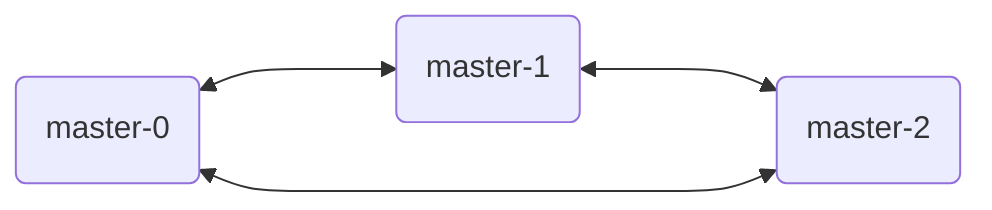

参考文章

1. [Mermaid从入门到入土——Markdown进阶语法](https://zhuanlan.zhihu.com/p/355997933)

vscode 需要安装"Markdown Preview Enhanced"插件.

mermaid很有意思

```mermaid
flowchart LR
A(master-0) <---> B(master-1) <---> C(master-2) <--> A(master-0)
```
